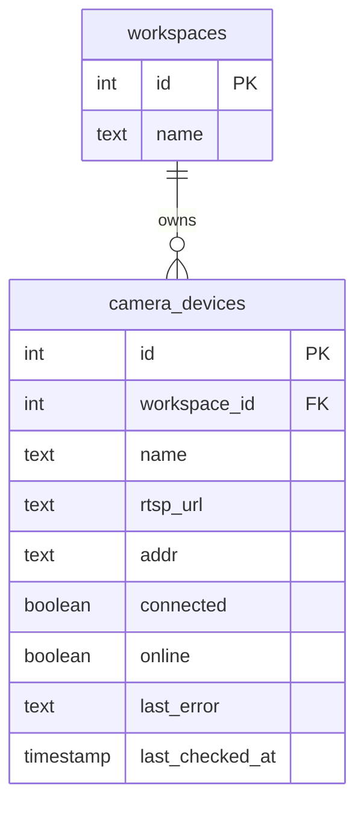

# 数据平台存储系统设计

## 架构总览

```
┌────────────────────────────────────┐
│            Web 平台 / API           │
└──────┬────────────────┬────────────┘
       │                │
┌──────▼──────┐   ┌─────▼───────────┐
│ PostgreSQL  │   │ 对象存储
│             │   │                  │
│ • 用户/权限  │   │ • 图片/视频       │
│ • 项目元数据 │   │ • 模型权重        │
│ • 工作流配置 │   │ • 部署包          │
│ • 采集元数据 │   │ • 训练配置快照     │
│ • 标注版本   │   │ • 推理结果        │
│ • 标注信息   │   │ • 训练导出包      │
│ • 数据集定义 │   │                  │
│ • 训练记录   │   │                  │
│ • 相机设备   │   │                  │
└─────────────┘   └─────────────────┘
```

对象存储使用seaweedFS，存储桶挂载到了本地的路径，data_path 路径在 config.json 中指定了。

相机数据：工作空间级表 `camera_devices`（见 2.5）。本阶段不落地部署方案表；
历史 `camera_solutions` 物理表可保留但不由应用读写。

---

## 一、对象存储目录结构

Bucket: `data-platform`

```
data_path/
├── model/                                             # 运行时内建模型，由仓库 model/ 启动同步
│   ├── yolo/
│   │   ├── yolo11n.pt
│   │   ├── yolo11l.pt
│   │   └── yolo11n-seg.pt
│   └── sam3/
│       └── xxx.pth
├── {workspace_name}/
│   ├── tmp/
│   └── {project_name}/
│       ├── data_clip/
│       │   └── {split_name}/                          # 每一次上传的数据批次
│       │       ├── video/                             # 原始视频
│       │       │   ├── 20260601_0900.mp4
│       │       │   └── 20260602_1400.mp4
│       │       └── images/                            # 抽帧和去重后的图片
│       │           ├── 20260601_0900/                 # 每个视频对应一个文件夹
│       │           │   ├── 000001.jpg
│       │           │   ├── 000002.jpg
│       │           │   └── ...
│       │           └── 20260602_1400/
│       │               ├── 000001.jpg
│       │               └── ...
│       │
│       └── datasets/
│           └── {dataset_name}/
│               ├── cache/                            # 数据库标注物化 cache
│               │   └── {fingerprint}/
│               │       ├── manifest.json
│               │       ├── data.yaml
│               │       ├── images/
│               │       └── labels/
│               └── models/
│                   └── {model_name}/                  # 训练名称
│                       └── {run_id}/                  # 防止同名训练互相覆盖
│                           ├── dataset -> ../../../cache/{fingerprint}/
│                           ├── weights/               # 模型权重
│                           │   ├── best.pt
│                           │   └── last.pt
│                           ├── deployment/            # 部署用模型文件
│                           │   └── best.onnx
│                           ├── config/                # 训练配置快照
│                           │   ├── param.json
│                           │   └── args.yaml
│                           ├── log/
│                           │   ├── log.txt            # 人类可读日志
│                           │   ├── results.jsonl      # 前端增量事件
│                           │   └── results.csv        # 框架原生指标表
│                           ├── image/                 # 指标图、loss 曲线
│                           │   ├── results.png
│                           │   ├── confusion_matrix.png
│                           │   ├── PR_curve.png
│                           │   └── F1_curve.png
│                           └── inference/             # 推理结果
│                               ├── collection_data/   # 对采集数据的推理
│                               │   └── {split_name}/
│                               │       ├── video/
│                               │       │   └── 20260601_0900/
│                               │       │       ├── 000001.json
│                               │       │       └── ...
│                               │       └── images/
│                               │           └── 20260601_0900/
│                               │               ├── 000001.json
│                               │               └── ...
│                               ├── train_set/         # 对训练集的推理
│                               │   └── {split_name}/
│                               │       └── 20260601_0900/
│                               │           ├── 000001.json
│                               │           └── ...
│                               └── val_set/           # 对验证集的推理
│                                   └── {split_name}/
│                                       └── 20260601_0900/
│                                           ├── 000001.json
│                                           └── ...
```


### 目录说明

| 路径 | 内容 | 说明 |
|------|------|------|
| `data_clip/{split}/video/` | 原始视频文件 | .mp4，体积最大 |
| `data_clip/{split}/images/` | 抽帧和去重的图片 | 按来源视频分文件夹 |
| `datasets/{dataset}/cache/{fingerprint}/` | 训练数据物化 cache | data.yaml、图片、标签和 manifest |
| `datasets/{dataset}/models/{model}/{run_id}/weights/` | 模型权重 | best.pt / last.pt |
| `datasets/{dataset}/models/{model}/{run_id}/deployment/` | 部署文件 | ONNX / TensorRT 等 |
| `datasets/{dataset}/models/{model}/{run_id}/config/` | 训练配置快照 | 训练时冻结的数据集和模型配置 |
| `datasets/{dataset}/models/{model}/{run_id}/log/` | 增量结果与日志 | results.jsonl / log.txt / results.csv |
| `datasets/{dataset}/models/{model}/{run_id}/image/` | 训练指标图 | loss、PR、F1、混淆矩阵等 |
| `datasets/{dataset}/models/{model}/{run_id}/inference/` | 推理结果 | JSON 文件，批量生成 |

### 训练增量事件协议

`log/results.jsonl` 使用 JSON Lines：每行是一个完整 JSON 对象，写完立即 flush。
前端记录最后消费的 `seq`，通过增量接口只请求更大的序号。文件尾部若因异常退出产生不完整
JSON 行，读取端忽略该行，后续写入从最后一个有效 `seq` 继续。

所有消息共享以下 envelope：

```json
{
  "schema_version": 1,
  "seq": 1,
  "timestamp": "2026-07-15T10:00:00.123Z",
  "type": "log",
  "value": "开始训练"
}
```

既有设计中的四类消息体完整定义如下。

#### log — 日志

`value` 为可直接展示的日志字符串。日志级别作为可选字段保留在 envelope 中。

```json
{"schema_version":1,"seq":1,"timestamp":"2026-07-15T10:00:00.123Z","type":"log","level":"INFO","value":"开始训练"}
```

#### progress — 进度

`value` 保留原 `{name: value}` 表达能力，同时提供统一的 current/total/percent。

```json
{
  "schema_version": 1,
  "seq": 2,
  "timestamp": "2026-07-15T10:00:03.123Z",
  "type": "progress",
  "value": {
    "name": "epoch",
    "epoch": 1,
    "current": 1,
    "total": 100,
    "percent": 1.0,
    "message": "epoch 1"
  }
}
```

#### graph — loss 曲线增量点

`value` 是“曲线名称 → 新增坐标点列表”的映射；一次 epoch 可以同时追加多条曲线。
横轴为 epoch，纵轴只保存训练/验证 loss。precision、recall、mAP 等指标由 Ultralytics
原生 PR/F1/confusion matrix 图片表达，避免不同量纲混在同一坐标轴。

```json
{
  "schema_version": 1,
  "seq": 3,
  "timestamp": "2026-07-15T10:00:03.124Z",
  "type": "graph",
  "value": {
    "train/box_loss": [[1, 1.253]],
    "train/cls_loss": [[1, 0.732]]
  }
}
```

#### image — 指标图片

`value` 延续原 `[name, path]` 结构；path 必须是相对本次 run 根目录的路径。相同路径只发布
一次 image 事件。

```json
{"schema_version":1,"seq":4,"timestamp":"2026-07-15T10:01:00.123Z","type":"image","value":["confusion_matrix","image/confusion_matrix.png"]}
```

运行时仍可用 Ray Actor 快照提供低延迟进度；`results.jsonl` 是可恢复的持久事件源，
`training_runs.metrics` 保存最终汇总，三者不能互相替代。

---

## 二、数据库表结构（PostgreSQL）

### 2.1 用户与权限

#### users — 用户表

| 字段 | 类型 | 说明 |
|------|------|------|
| id | SERIAL PRIMARY KEY | 用户 ID |
| username | TEXT UNIQUE NOT NULL | 用户名 |
| password_hash | TEXT NOT NULL | 密码哈希 |
| email | TEXT | 邮箱 |
| role | TEXT DEFAULT 'user' | 全局角色：admin / user |
| created_at | TIMESTAMP DEFAULT NOW() | 创建时间 |

```sql
CREATE TABLE users (
    id SERIAL PRIMARY KEY,
    username TEXT UNIQUE NOT NULL,
    password_hash TEXT NOT NULL,
    email TEXT,
    role TEXT DEFAULT 'user',
    created_at TIMESTAMP DEFAULT NOW()
);
```

#### workspaces — 工作空间表

| 字段 | 类型 | 说明 |
|------|------|------|
| id | SERIAL PRIMARY KEY | 工作空间 ID |
| name | TEXT NOT NULL | 工作空间名称 |
| owner_id | INT REFERENCES users(id) | 所有者 |
| created_at | TIMESTAMP DEFAULT NOW() | 创建时间 |

```sql
CREATE TABLE workspaces (
    id SERIAL PRIMARY KEY,
    name TEXT NOT NULL,
    owner_id INT REFERENCES users(id),
    created_at TIMESTAMP DEFAULT NOW()
);
```

应用层创建新用户时，`users` 与默认 `{username}_workspace` 在同一事务内写入；
用户为 owner，且不在 `workspace_members` 中重复记录。历史用户不做批量回填。

#### workspace_members — 工作空间成员表

记录 workspace 的所有成员，owner 之外的用户通过此表加入。

| 字段 | 类型 | 说明 |
|------|------|------|
| id | SERIAL PRIMARY KEY | 成员记录 ID |
| workspace_id | INT REFERENCES workspaces(id) ON DELETE CASCADE | 工作空间 |
| user_id | INT REFERENCES users(id) ON DELETE CASCADE | 成员用户 |
| role | TEXT DEFAULT 'member' | 空间角色：admin / member |
| joined_at | TIMESTAMP DEFAULT NOW() | 加入时间 |

```sql
CREATE TABLE workspace_members (
    id SERIAL PRIMARY KEY,
    workspace_id INT REFERENCES workspaces(id) ON DELETE CASCADE,
    user_id INT REFERENCES users(id) ON DELETE CASCADE,
    role TEXT DEFAULT 'member',
    joined_at TIMESTAMP DEFAULT NOW(),
    UNIQUE(workspace_id, user_id)
);
```

成员判断逻辑：
- workspace.owner_id = 当前用户 → 该 workspace 的所有者，拥有最高权限
- workspace_members 中存在记录 → 该 workspace 的成员，权限由 role 决定
- owner 不需要在 workspace_members 中重复记录

#### project_members — 项目成员表（设计预留，尚未落地）

> 当前 `backend/database/models.py` **未实现**此表。现有可见性以 workspace owner / `workspace_members` 为准。以下为规划 schema，落地时须同步到 ORM 与本节。

记录项目对哪些用户可见。某个用户存在记录时，该项目对其可见。

| 字段 | 类型 | 说明 |
|------|------|------|
| id | SERIAL PRIMARY KEY | 成员记录 ID |
| project_id | INT REFERENCES projects(id) ON DELETE CASCADE | 项目 |
| user_id | INT REFERENCES users(id) ON DELETE CASCADE | 成员用户 |
| role | TEXT DEFAULT 'member' | 项目角色：admin / member |
| joined_at | TIMESTAMP DEFAULT NOW() | 加入时间 |

```sql
CREATE TABLE project_members (
    id SERIAL PRIMARY KEY,
    project_id INT REFERENCES projects(id) ON DELETE CASCADE,
    user_id INT REFERENCES users(id) ON DELETE CASCADE,
    role TEXT DEFAULT 'member',
    joined_at TIMESTAMP DEFAULT NOW(),
    UNIQUE(project_id, user_id)
);
```

可见性判断逻辑（落地后）：
- workspace.owner_id = 当前用户 → 该 workspace 下所有 project 均可见
- project_members 中存在记录 → 该 project 对该用户可见，权限由 role 决定

#### model_members — 模型成员表

记录模型（model_results）对哪些用户可见。某个用户存在记录时，该模型对其可见。

| 字段 | 类型 | 说明 |
|------|------|------|
| id | SERIAL PRIMARY KEY | 成员记录 ID |
| model_result_id | INT REFERENCES model_results(id) ON DELETE CASCADE | 模型 |
| user_id | INT REFERENCES users(id) ON DELETE CASCADE | 成员用户 |
| joined_at | TIMESTAMP DEFAULT NOW() | 加入时间 |

```sql
CREATE TABLE model_members (
    id SERIAL PRIMARY KEY,
    model_result_id INT REFERENCES model_results(id) ON DELETE CASCADE,
    user_id INT REFERENCES users(id) ON DELETE CASCADE,
    joined_at TIMESTAMP DEFAULT NOW(),
    UNIQUE(model_result_id, user_id)
);
```

可见性判断逻辑：
- model_members 中存在记录 → 该 model 对该用户可见（本表无 role 字段，仅控制可见性）

---

### 2.2 项目、工作流与数据采集

#### projects — 项目表

对应原 `projects_A/meta.json`

| 字段 | 类型 | 说明 |
|------|------|------|
| id | SERIAL PRIMARY KEY | 项目 ID |
| workspace_id | INT REFERENCES workspaces(id) | 所属工作空间 |
| name | TEXT NOT NULL | 项目名称（如"工厂1"） |
| status | TEXT DEFAULT '进行中' | 状态 |
| notes | TEXT | 备注 |
| created_at | TIMESTAMP DEFAULT NOW() | 创建时间 |

```sql
CREATE TABLE projects (
    id SERIAL PRIMARY KEY,
    workspace_id INT REFERENCES workspaces(id) ON DELETE CASCADE,
    name TEXT NOT NULL,
    status TEXT DEFAULT '进行中',
    notes TEXT,
    created_at TIMESTAMP DEFAULT NOW()
);
```

#### workflows — 工作流表

工作流归属 workspace（不挂在 project 下）。完整规格（inputs / steps / outputs / UI 元数据）保存在 `config` JSONB 中，不落地到对象存储。

| 字段 | 类型 | 说明 |
|------|------|------|
| id | SERIAL PRIMARY KEY | 工作流 ID |
| workspace_id | INT REFERENCES workspaces(id) ON DELETE CASCADE | 所属工作空间 |
| name | TEXT NOT NULL | 工作流名称 |
| config | JSONB NOT NULL | 工作流规格（含 UI 布局） |
| created_at | TIMESTAMP DEFAULT NOW() | 创建时间 |
| updated_at | TIMESTAMP DEFAULT NOW() | 更新时间 |
| deleted_at | TIMESTAMP NULL | 软删除时间；NULL=有效，非空=回收站 |

```sql
CREATE TABLE workflows (
    id SERIAL PRIMARY KEY,
    workspace_id INT REFERENCES workspaces(id) ON DELETE CASCADE,
    name TEXT NOT NULL,
    config JSONB NOT NULL,
    created_at TIMESTAMP DEFAULT NOW(),
    updated_at TIMESTAMP DEFAULT NOW(),
    deleted_at TIMESTAMP,
    UNIQUE (workspace_id, name)
);
```

`(workspace_id, name)` 全局唯一，回收站记录仍占用名称；软删除后同名无法新建，需先彻底删除或改名后再创建。

已有库的轻量迁移（与 `backend/database/connection.py` `_migrate` 一致）：

```sql
ALTER TABLE workflows ADD COLUMN IF NOT EXISTS deleted_at TIMESTAMP;
```

#### data_clips — 数据批次表

对应原 `data_clip/{split_name}/meta.json`

| 字段 | 类型 | 说明 |
|------|------|------|
| id | SERIAL PRIMARY KEY | 批次 ID |
| project_id | INT REFERENCES projects(id) | 所属项目 |
| name | TEXT NOT NULL | 批次名称（如"工位A_0"） |
| image_count | INT DEFAULT 0 | 图片数量 |
| user | TEXT | 上传用户 |
| notes | TEXT | 备注 |
| storage_prefix | TEXT | 对象存储路径前缀 |
| created_at | TIMESTAMP DEFAULT NOW() | 创建时间 |

```sql
CREATE TABLE data_clips (
    id SERIAL PRIMARY KEY,
    project_id INT REFERENCES projects(id) ON DELETE CASCADE,
    name TEXT NOT NULL,
    image_count INT DEFAULT 0,
    user TEXT,
    notes TEXT,
    storage_prefix TEXT,
    created_at TIMESTAMP DEFAULT NOW()
);
```

#### images — 图片表

图片本身不存标注流转状态；状态挂在「标注版本 × 图片」上，见 `version_image_status`。

| 字段 | 类型 | 说明 |
|------|------|------|
| id | SERIAL PRIMARY KEY | 图片 ID |
| data_clip_id | INT REFERENCES data_clips(id) | 所属数据批次 |
| video_source | TEXT | 来源视频名称（如"20260601_0900"） |
| file_name | TEXT NOT NULL | 文件名（如"000001.jpg"） |
| storage_key | TEXT NOT NULL | 对象存储完整路径 |
| width | INT | 图片宽度 |
| height | INT | 图片高度 |
| hash | TEXT | 文件哈希（普通索引，非唯一；仅供查询，迁移不做去重） |
| tag_ids | INT[] | 图片级 tag ID 列表（引用 tag_definitions 中 scope='image' 的记录） |
| created_at | TIMESTAMP DEFAULT NOW() | 创建时间 |

```sql
CREATE TABLE images (
    id SERIAL PRIMARY KEY,
    data_clip_id INT REFERENCES data_clips(id) ON DELETE CASCADE,
    video_source TEXT,
    file_name TEXT NOT NULL,
    storage_key TEXT NOT NULL,
    width INT,
    height INT,
    hash TEXT,
    tag_ids INT[],
    created_at TIMESTAMP DEFAULT NOW()
);

CREATE INDEX idx_images_split ON images(data_clip_id);
CREATE INDEX idx_images_video ON images(video_source);
CREATE INDEX idx_images_hash ON images(hash);
```

---

### 2.3 标注

#### tag_definitions — 标签(tag)定义表

定义每个项目可用的 tag，分为图片级 tag 和标注级 tag。标注时从预设列表中选择。

| 字段 | 类型 | 说明 |
|------|------|------|
| id | SERIAL PRIMARY KEY | tag 定义 ID |
| project_id | INT REFERENCES projects(id) | 所属项目 |
| scope | TEXT NOT NULL | 作用范围：image / annotation |
| name | TEXT NOT NULL | tag 名称（如 occluded、low_light） |
| description | TEXT | tag 说明 |
| created_at | TIMESTAMP DEFAULT NOW() | 创建时间 |

```sql
CREATE TABLE tag_definitions (
    id SERIAL PRIMARY KEY,
    project_id INT REFERENCES projects(id) ON DELETE CASCADE,
    scope TEXT NOT NULL,
    name TEXT NOT NULL,
    description TEXT,
    created_at TIMESTAMP DEFAULT NOW(),
    UNIQUE(project_id, scope, name)
);
```

scope 取值说明：
- `image` — 图片级 tag（如 low_light、blurry、daytime）
- `annotation` — 标注级 tag（如 occluded、truncated、crowd）

#### labels — 标签定义表

对应 JSON 中的 `labels` 字段，每个项目独立定义标签。

| 字段 | 类型 | 说明 |
|------|------|------|
| id | SERIAL PRIMARY KEY | 标签 ID |
| project_id | INT REFERENCES projects(id) | 所属项目 |
| name | TEXT NOT NULL | 标签名称（person / car 等） |
| color | TEXT | 显示颜色 |
| keypoint_names | JSONB | 关键点名称列表（keypoint 类型专用） |

```sql
CREATE TABLE labels (
    id SERIAL PRIMARY KEY,
    project_id INT REFERENCES projects(id) ON DELETE CASCADE,
    name TEXT NOT NULL,
    color TEXT,
    keypoint_names JSONB,
    UNIQUE(project_id, name)
);
```

#### annotation_versions — 标注版本表

对应原 `annotations/{version_name}/meta.json`。版本为**项目级**：一个版本自动覆盖该项目下全部图集（含之后新上传的图集），不再挂在单个 `data_clips` 下。

应用层创建项目时，同一事务内创建 `manual_1` 默认版本：
`annotation_type=detection`、`method=manual`、`classes=[]`。历史项目首次进入标注
入口时若无版本，由前端通过标准版本创建接口懒补该默认版本。

| 字段 | 类型 | 说明 |
|------|------|------|
| id | SERIAL PRIMARY KEY | 版本 ID |
| project_id | INT REFERENCES projects(id) | 所属项目 |
| name | TEXT NOT NULL | 版本名称（如"det_sam3_0"） |
| annotation_type | TEXT NOT NULL | 标注类型：detection / detection_rota / segmentation / keypoint / classification |
| method | TEXT | 标注方式：manual / sam3 / 使用的某一个模型 |
| parent_id | INT REFERENCES annotation_versions(id) | 父版本 ID |
| classes | JSONB | 标注的类别列表 |
| reviewed | BOOLEAN DEFAULT FALSE | 是否已审核 |
| reviewer | TEXT | 审核人 |
| notes | TEXT | 备注 |
| created_at | TIMESTAMP DEFAULT NOW() | 创建时间 |
| updated_at | TIMESTAMP DEFAULT NOW() | 更新时间 |

```sql
CREATE TABLE annotation_versions (
    id SERIAL PRIMARY KEY,
    project_id INT REFERENCES projects(id) ON DELETE CASCADE,
    name TEXT NOT NULL,
    annotation_type TEXT NOT NULL,
    method TEXT,
    parent_id INT REFERENCES annotation_versions(id),
    classes JSONB,
    reviewed BOOLEAN DEFAULT FALSE,
    reviewer TEXT,
    notes TEXT,
    created_at TIMESTAMP DEFAULT NOW(),
    updated_at TIMESTAMP DEFAULT NOW()
);
```

已有库的轻量迁移（与 `backend/database/connection.py` `_migrate` 一致；开发阶段旧的批次级版本可丢弃）：

```sql
ALTER TABLE annotation_versions ADD COLUMN IF NOT EXISTS
    project_id INTEGER REFERENCES projects(id) ON DELETE CASCADE;
DELETE FROM dataset_splits WHERE annotation_version_id IN
    (SELECT id FROM annotation_versions WHERE project_id IS NULL);
DELETE FROM annotation_versions WHERE project_id IS NULL;
ALTER TABLE annotation_versions DROP COLUMN IF EXISTS data_clip_id;
ALTER TABLE images DROP COLUMN IF EXISTS status;
DROP INDEX IF EXISTS idx_images_status;
```

#### version_image_status — 版本 × 图片状态表

某标注版本下某张图片的标注流转状态。状态挂在「版本 × 图片」维度，图片本身无状态字段。

| 字段 | 类型 | 说明 |
|------|------|------|
| id | SERIAL PRIMARY KEY | 记录 ID |
| version_id | INT REFERENCES annotation_versions(id) ON DELETE CASCADE | 所属标注版本 |
| image_id | INT REFERENCES images(id) ON DELETE CASCADE | 所属图片 |
| status | TEXT NOT NULL DEFAULT 'annotating' | 状态：annotating / in_review / dataset |
| updated_at | TIMESTAMP DEFAULT NOW() | 更新时间 |

```sql
CREATE TABLE version_image_status (
    id SERIAL PRIMARY KEY,
    version_id INT NOT NULL REFERENCES annotation_versions(id) ON DELETE CASCADE,
    image_id INT NOT NULL REFERENCES images(id) ON DELETE CASCADE,
    status TEXT NOT NULL DEFAULT 'annotating',
    updated_at TIMESTAMP DEFAULT NOW(),
    UNIQUE(version_id, image_id)
);

CREATE INDEX idx_vis_version_status ON version_image_status(version_id, status);
```

状态语义：
- **无记录** = `unannotated`（未标注，懒创建，不写行）
- `annotating` — 正在标注
- `in_review` — 待审核
- `dataset` — 已进入数据集可用状态

流转：`unannotated` →（保存标注）→ `annotating` →（submit_review）→ `in_review` →（approve）→ `dataset`；
`in_review` 可 `reject` 回 `annotating`，亦可 `to_unannotated`；
`annotating` / `dataset` 可 `to_unannotated`；`dataset` 可 `to_review` 回待审核。
回退未标注通过**删除** `version_image_status` 行实现。

关系示意：

```
Project
  ├── DataClip ── Image[]                     # 图片无状态字段
  └── AnnotationVersion (project_id)          # 项目级版本
        ├── Annotation (version_id, image_id) # 标注实例
        └── VersionImageStatus                # 版本 × 图片状态
              (version_id, image_id) 唯一
```

更完整的 API / 状态机说明见 `doc/design_doc/annotation_version_rework/design.md`。

#### annotations — 标注信息表

对应 JSON 中每张图片的每个标注实例。使用统一的 `data` 字段存储标注数据，根据所属标注版本的 `annotation_type` 决定数据格式。

| 字段 | 类型 | 说明 |
|------|------|------|
| id | SERIAL PRIMARY KEY | 标注 ID |
| image_id | INT REFERENCES images(id) | 所属图片 |
| version_id | INT REFERENCES annotation_versions(id) | 所属标注版本 |
| label_id | INT REFERENCES labels(id) | 标签 ID |
| tag_ids | INT[] | 标注级 tag ID 列表（引用 tag_definitions 中 scope='annotation' 的记录） |
| confidence | REAL | 置信度（0-1，手动标注可为 NULL，模型推理时有值） |
| data | JSONB NOT NULL | 标注数据，格式由标注版本的 annotation_type 决定（见下方说明） |
| created_at | TIMESTAMP DEFAULT NOW() | 创建时间 |

```sql
CREATE TABLE annotations (
    id SERIAL PRIMARY KEY,
    image_id INT REFERENCES images(id) ON DELETE CASCADE,
    version_id INT REFERENCES annotation_versions(id) ON DELETE CASCADE,
    label_id INT REFERENCES labels(id),
    tag_ids INT[],
    confidence REAL,
    data JSONB NOT NULL,
    created_at TIMESTAMP DEFAULT NOW()
);

CREATE INDEX idx_anno_image ON annotations(image_id);
CREATE INDEX idx_anno_version ON annotations(version_id);
CREATE INDEX idx_anno_label ON annotations(label_id);
```

#### data 字段格式说明

`data` 的内容由所属 `annotation_versions.annotation_type` 决定：

所有坐标使用**归一化比例值**（0.0 ~ 1.0），不使用像素值。`x = 像素x / 图片宽度`，`y = 像素y / 图片高度`。这样标注数据与分辨率无关，图片缩放后标注仍然有效。

| annotation_type | data 格式 | 示例 |
|----------------|-----------|------|
| detection | `[cx, cy, w, h]` | `[0.104, 0.139, 0.167, 0.417]` |
| detection_rota | `[cx, cy, w, h, angle]` | `[0.135, 0.278, 0.063, 0.278, 15.5]` |
| segmentation | `[[x,y], ...]` | `[[0.109,0.139], [0.135,0.144], [0.161,0.185]]` |
| keypoint | `[[x,y,v], ...]` | `[[0.161,0.079,2], [0.159,0.072,2], [0.166,0.072,0]]` |
| classification | `null` | `null` |

各类型详细说明：

- **detection** — `[cx, cy, w, h]`，中心点归一化坐标、归一化宽高
- **detection_rota** — `[cx, cy, w, h, angle]`，中心点归一化坐标、归一化宽高、旋转角度（度，角度不归一化）
- **segmentation** — `[[x1,y1], [x2,y2], ...]`，多边形顶点归一化坐标列表，按顺序连接闭合
- **keypoint** — `[[x1,y1,v1], [x2,y2,v2], ...]`，固定顺序的关键点列表，xy 为归一化坐标，v 表示可见性（0=未标注，1=遮挡，2=可见），顺序由 `labels.keypoint_names` 定义
- **classification** — `null`，分类任务无空间坐标数据，类别信息仅由 `label_id` 表示

转换公式：
- 存入：`x_norm = x_pixel / width`，`y_norm = y_pixel / height`
- 读取：`x_pixel = x_norm * width`，`y_pixel = y_norm * height`
- 图片宽高从 `images` 表的 `width`、`height` 字段获取

---

### 2.4 数据集与训练

#### datasets — 数据集表

对应原 `datasets/{dataset_name}/dataset_info.json`

| 字段 | 类型 | 说明 |
|------|------|------|
| id | SERIAL PRIMARY KEY | 数据集 ID |
| project_id | INT REFERENCES projects(id) | 所属项目 |
| name | TEXT NOT NULL | 数据集名称（如"person_det_0"） |
| created_at | TIMESTAMP DEFAULT NOW() | 创建时间 |

```sql
CREATE TABLE datasets (
    id SERIAL PRIMARY KEY,
    project_id INT REFERENCES projects(id) ON DELETE CASCADE,
    name TEXT NOT NULL,
    created_at TIMESTAMP DEFAULT NOW()
);
```

#### dataset_splits — 数据集划分表

对应原 dataset_info.json 中的 `splits` 字段（变长列表）。

| 字段 | 类型 | 说明 |
|------|------|------|
| id | SERIAL PRIMARY KEY | 划分 ID |
| dataset_id | INT REFERENCES datasets(id) | 所属数据集 |
| split | TEXT NOT NULL | 划分类型：train / val / test |
| data_clip_id | INT REFERENCES data_clips(id) | 引用的数据批次 |
| annotation_version_id | INT REFERENCES annotation_versions(id) | 引用的标注版本 |
| index_start | INT | 起始索引 |
| index_end | INT | 结束索引 |

```sql
CREATE TABLE dataset_splits (
    id SERIAL PRIMARY KEY,
    dataset_id INT REFERENCES datasets(id) ON DELETE CASCADE,
    split TEXT NOT NULL,
    data_clip_id INT REFERENCES data_clips(id),
    annotation_version_id INT REFERENCES annotation_versions(id),
    index_start INT,
    index_end INT
);
```

#### training_runs — 训练任务表

对应原 `models/{model_name}/meta.json`，模型文件本身存对象存储。

| 字段 | 类型 | 说明 |
|------|------|------|
| id | SERIAL PRIMARY KEY | 训练任务 ID |
| project_id | INT REFERENCES projects(id) | 所属项目 |
| dataset_id | INT REFERENCES datasets(id) | 使用的数据集 |
| name | TEXT NOT NULL | 训练任务展示名（如"person_det_yolo11n_0"） |
| model_name | TEXT | `_MODEL_REGISTRY` key，例如 `ultralytics_yolo` |
| code_config | TEXT | 代码配置 / commit ID |
| pretrained_model | TEXT | 预训练模型路径或来源 |
| training_config | JSONB | 训练配置（device、batch_size 等） |
| metrics | JSONB | 训练指标（precision、recall、train_time） |
| tags | TEXT[] | 模型标签 |
| status | TEXT DEFAULT 'queued' | 状态：queued / running / completed / failed / succeeded / cancelled |
| storage_prefix | TEXT | 对象存储中模型目录的路径前缀 |
| started_at | TIMESTAMP | 开始时间 |
| finished_at | TIMESTAMP | 结束时间 |
| created_at | TIMESTAMP DEFAULT NOW() | 创建时间 |

```sql
CREATE TABLE training_runs (
    id SERIAL PRIMARY KEY,
    project_id INT REFERENCES projects(id) ON DELETE CASCADE,
    dataset_id INT REFERENCES datasets(id) ON DELETE SET NULL,
    name TEXT NOT NULL,
    model_name TEXT,
    code_config TEXT,
    pretrained_model TEXT,
    training_config JSONB,
    metrics JSONB,
    tags TEXT[],
    status TEXT DEFAULT 'queued',
    storage_prefix TEXT,
    started_at TIMESTAMP,
    finished_at TIMESTAMP,
    created_at TIMESTAMP DEFAULT NOW()
);
```

已有库的轻量迁移（与 `backend/database/connection.py` `_migrate` 一致）：

```sql
ALTER TABLE training_runs ADD COLUMN IF NOT EXISTS
    project_id INTEGER REFERENCES projects(id) ON DELETE CASCADE;
ALTER TABLE training_runs ADD COLUMN IF NOT EXISTS model_name TEXT;
```

#### model_results — 模型结果表

记录训练产出的模型，包含模型名称、对象存储中的模型路径以及训练用户。

| 字段 | 类型 | 说明 |
|------|------|------|
| id | SERIAL PRIMARY KEY | 模型结果 ID |
| training_run_id | INT UNIQUE REFERENCES training_runs(id) | 对应训练任务；实现扩展的一对一关联 |
| workspace_id | INT REFERENCES workspaces(id) | 所属工作空间 |
| project_id | INT REFERENCES projects(id) | 所属项目 |
| dataset_id | INT REFERENCES datasets(id) | 所属数据集 |
| model_name | TEXT NOT NULL | `_MODEL_REGISTRY` key，例如 `ultralytics_yolo` |
| display_name | TEXT | 展示名称，例如训练任务名 |
| model_path | TEXT NOT NULL | 相对 data_path 的 `weights/best.pt` 路径 |
| user | TEXT | 训练用户 |
| status | TEXT DEFAULT '未完成' | 状态：未完成 / 完成 / 失败 / 已取消 |
| status_message | TEXT | 失败、取消或产物缺失说明 |
| classes | JSONB | 权重内类别名缓存 `["person", ...]`，自动标注类别映射用，首次读取时回填 |
| created_at | TIMESTAMP DEFAULT NOW() | 创建时间 |

```sql
CREATE TABLE model_results (
    id SERIAL PRIMARY KEY,
    training_run_id INT UNIQUE NOT NULL REFERENCES training_runs(id) ON DELETE CASCADE,
    workspace_id INT REFERENCES workspaces(id) ON DELETE CASCADE,
    project_id INT REFERENCES projects(id) ON DELETE CASCADE,
    dataset_id INT REFERENCES datasets(id) ON DELETE SET NULL,
    model_name TEXT NOT NULL,
    display_name TEXT,
    model_path TEXT NOT NULL,
    user TEXT,
    status TEXT DEFAULT '未完成',
    status_message TEXT,
    classes JSONB,
    created_at TIMESTAMP DEFAULT NOW()
);
```

已有库的轻量迁移（与 `backend/database/connection.py` `_migrate` 一致）：

```sql
ALTER TABLE model_results ADD COLUMN IF NOT EXISTS classes JSONB;
```

创建训练任务时同步创建“未完成”的模型结果；`model_name` 必须能被
`get_model_class(model_name)` 找到，展示用名称写入 `display_name`。只有 `weights/best.pt` 和
`deployment/best.onnx` 均成功生成后才更新为“完成”。`model_members` 至少包含训练发起人。

#### auto_label_jobs — 自动标注任务表

对标 Roboflow Auto Label：用模型（SAM3 零样本或已完成的训练产物）批量预标注
若干图集，结果写入项目级标注版本。状态与进度由 Ray 任务在运行中实时回写，
前端轮询本表即可；后端重启时遗留的 queued/running 记录标为 failed。

| 字段 | 类型 | 说明 |
|------|------|------|
| id | SERIAL PRIMARY KEY | 任务 ID |
| project_id | INT NOT NULL REFERENCES projects(id) ON DELETE CASCADE | 所属项目 |
| annotation_version_id | INT NOT NULL REFERENCES annotation_versions(id) ON DELETE CASCADE | 目标标注版本 |
| name | TEXT NOT NULL | 任务名称 |
| data_clip_ids | JSONB NOT NULL | 参与自动标注的图集 ID 列表 `[1, 2]` |
| model_config | JSONB NOT NULL | 模型配置：`{kind: 'sam3'\|'model_result', model_result_id?, prompts?, class_mapping?, conf?, iou?, device?}`。SAM3 默认 `conf=0.5`、`device="0"`；推理精度与 Ray 资源声明见 `doc/design_doc/auto_label/sam3_resources.md`（`float16`、`num_gpus=0.25`、`memory_gb=8`、预览 TTL 90s） |
| overwrite | BOOLEAN DEFAULT FALSE | 是否覆盖已有标注（默认跳过已标注图片） |
| status | TEXT DEFAULT 'queued' | queued / running / succeeded / failed / cancelled |
| progress | JSONB | `{total, processed, written, skipped, failed}` |
| error | TEXT | 失败原因或单图失败摘要 |
| user_id | INT REFERENCES users(id) ON DELETE SET NULL | 发起用户 |
| created_at | TIMESTAMP DEFAULT NOW() | 创建时间 |
| started_at | TIMESTAMP | 开始时间 |
| finished_at | TIMESTAMP | 结束时间 |

```sql
CREATE TABLE auto_label_jobs (
    id SERIAL PRIMARY KEY,
    project_id INT NOT NULL REFERENCES projects(id) ON DELETE CASCADE,
    annotation_version_id INT NOT NULL REFERENCES annotation_versions(id) ON DELETE CASCADE,
    name TEXT NOT NULL,
    data_clip_ids JSONB NOT NULL,
    model_config JSONB NOT NULL,
    overwrite BOOLEAN DEFAULT FALSE,
    status TEXT DEFAULT 'queued',
    progress JSONB,
    error TEXT,
    user_id INT REFERENCES users(id) ON DELETE SET NULL,
    created_at TIMESTAMP DEFAULT NOW(),
    started_at TIMESTAMP,
    finished_at TIMESTAMP
);

CREATE INDEX idx_auto_label_jobs_project ON auto_label_jobs(project_id);
```

#### uploaded_weights — 用户上传预训练权重

| 字段 | 类型 | 说明 |
|------|------|------|
| id | SERIAL PRIMARY KEY | 上传权重 ID |
| workspace_id | INT REFERENCES workspaces(id) | 所属工作空间 |
| project_id | INT REFERENCES projects(id) | 所属项目 |
| model_name | TEXT NOT NULL DEFAULT 'ultralytics_yolo' | `_MODEL_REGISTRY` key，历史数据默认 `ultralytics_yolo` |
| name | TEXT NOT NULL | 展示名称 |
| task | TEXT NOT NULL | detect / segment |
| storage_key | TEXT UNIQUE NOT NULL | 相对 data_path 的 `.pt` 路径 |
| size | BIGINT NOT NULL | 文件字节数 |
| sha256 | TEXT NOT NULL | 内容摘要 |
| user_id | INT REFERENCES users(id) | 上传用户 |
| created_at | TIMESTAMP DEFAULT NOW() | 上传时间 |

```sql
CREATE TABLE uploaded_weights (
    id SERIAL PRIMARY KEY,
    workspace_id INT REFERENCES workspaces(id) ON DELETE CASCADE,
    project_id INT REFERENCES projects(id) ON DELETE CASCADE,
    model_name TEXT NOT NULL DEFAULT 'ultralytics_yolo',
    name TEXT NOT NULL,
    task TEXT NOT NULL,
    storage_key TEXT UNIQUE NOT NULL,
    size BIGINT NOT NULL,
    sha256 TEXT NOT NULL,
    user_id INT REFERENCES users(id) ON DELETE SET NULL,
    created_at TIMESTAMP DEFAULT NOW()
);

CREATE INDEX idx_uploaded_weights_project ON uploaded_weights(project_id);
```

已有库的轻量迁移（与 `backend/database/connection.py` `_migrate` 一致）：

```sql
ALTER TABLE uploaded_weights ADD COLUMN IF NOT EXISTS model_name TEXT;
UPDATE uploaded_weights SET model_name = 'ultralytics_yolo'
    WHERE model_name IS NULL;
ALTER TABLE uploaded_weights ALTER COLUMN model_name SET DEFAULT 'ultralytics_yolo';
ALTER TABLE uploaded_weights ALTER COLUMN size TYPE BIGINT;
```

上传权重、已完成的 `model_results` 与 `data_path/model/` 内建模型共同组成预训练权重目录。
前端仅提交 `builtin:{model_name}:{relative_path}`、`upload:*` 或 `model_result:*` 来源 ID，
服务器解析并验证实际路径。旧 `builtin:yolo11n.pt` 格式保留兼容，内部映射到
`model/yolo/yolo11n.pt`。

### 2.5 Deployments / Cameras（相机管理）

本节描述 Deployments 模块中与相机相关的数据库表、字段语义、逻辑关系和运行时设计。

#### 2.5.1 模块定位

前端工作空间导航入口为 **Deployments**（位于 Models 下方），页面内包含两个 Tab：

| Tab | 路由 | 说明 |
|-----|------|------|
| 相机列表 | `/workspace/{workspace_id}/deployments/cameras` | 已实现：相机 CRUD、连接/断开、RTSP 测试、实时预览 |
| Deployments | `/workspace/{workspace_id}/deployments/solutions` | 占位，本阶段无业务与无新表 |

本阶段数据库只落地相机设备表，不包含部署方案、GPU 配额、工作流绑定或推理流。

命名兼容约定：

| 层级 | 当前名称 |
|------|----------|
| 前端导航 / 路由前缀 | `Deployments` / `/workspace/{workspace_id}/deployments` |
| 后端兼容 API 前缀 | `/api/workspaces/{workspace_id}/camera-solutions` |
| 相机物理表 | `camera_devices` |
| ORM 模型 | `CameraDevice` |

后端不依赖 SVAP。历史 RTSP 地址可一次性导入，导入后由 AutoPipe 的 PostgreSQL、
MediaMTX 与 `CameraService` 独立管理。

#### 2.5.2 后端分层与数据归属

```text
Deployments 页面（相机列表 Tab）
    │
    ▼
camera_solutions Router
    ├── 相机 CRUD
    ├── RTSP 测试（ffprobe）
    ├── 连接 / 断开（单台与全部）
    └── WHEP 信令代理
            │
            ├── CameraService
            │     ├── PostgreSQL: camera_devices   ← 唯一持久化表
            │     ├── ffprobe: RTSP 主动连通测试
            │     └── MediaMTX Control API: 动态流路径 camera-{id}
            └── MediaMTX（运行时，非数据库）
                  ├── RTSP 拉流
                  ├── WHEP/WebRTC 播放
                  └── path ready → 刷新 online
```

职责边界：

| 组件 | 职责 |
|------|------|
| `routers/camera_solutions.py` | 鉴权、工作空间校验、HTTP 错误映射、列表响应脱敏 |
| `services/camera_service.py` | 相机持久化、RTSP 校验、连接状态、MediaMTX 路径同步 |
| MediaMTX | 拉取 RTSP，并通过 WHEP/WebRTC 向浏览器播放 |
| PostgreSQL `camera_devices` | 保存相机定义、连接意图与最近探测状态 |

说明：MediaMTX 路径名约定为 `camera-{camera_devices.id}`，该映射只存在于运行时，
不单独建表。

#### 2.5.3 camera_devices — 相机表（已实现）

每台相机归属于一个工作空间。同一工作空间内相机名称唯一。完整 RTSP URL（可能含账号
密码）只保存在后端数据库；列表接口不得回传完整 `rtsp_url`。

| 字段 | 类型 | 约束 / 默认值 | 说明 |
|------|------|---------------|------|
| id | SERIAL | PRIMARY KEY | AutoPipe 相机 ID；MediaMTX 路径使用 `camera-{id}` |
| workspace_id | INT | NOT NULL, FK → `workspaces.id` ON DELETE CASCADE | 所属工作空间 |
| name | TEXT | NOT NULL | 相机显示名称；与 `workspace_id` 组成唯一约束 |
| rtsp_url | TEXT | NOT NULL | 完整 RTSP / RTSPS 地址，敏感信息，仅后端持有 |
| addr | TEXT | 可空 | 从 `rtsp_url` 解析出的主机地址，供前端展示 |
| notes | TEXT | 可空 | 备注 |
| connected | BOOLEAN | NOT NULL DEFAULT FALSE | 是否要求 MediaMTX 拉流（用户连接意图） |
| online | BOOLEAN | NOT NULL DEFAULT FALSE | MediaMTX 最近检测到 path 是否 ready |
| last_error | TEXT | 可空 | 最近一次测试或流服务错误信息 |
| last_checked_at | TIMESTAMP | 可空 | 最近一次探测时间 |
| created_at | TIMESTAMP | DEFAULT NOW() | 创建时间 |
| updated_at | TIMESTAMP | DEFAULT NOW() | 更新时间 |

```sql
CREATE TABLE camera_devices (
    id SERIAL PRIMARY KEY,
    workspace_id INT NOT NULL
        REFERENCES workspaces(id) ON DELETE CASCADE,
    name TEXT NOT NULL,
    rtsp_url TEXT NOT NULL,
    addr TEXT,
    notes TEXT,
    connected BOOLEAN NOT NULL DEFAULT FALSE,
    online BOOLEAN NOT NULL DEFAULT FALSE,
    last_error TEXT,
    last_checked_at TIMESTAMP,
    created_at TIMESTAMP DEFAULT NOW(),
    updated_at TIMESTAMP DEFAULT NOW(),
    CONSTRAINT uq_camera_device_workspace_name
        UNIQUE (workspace_id, name)
);

CREATE INDEX idx_camera_device_workspace
    ON camera_devices(workspace_id);
```

轻量迁移（`database/connection.py`）：

```sql
ALTER TABLE camera_devices
    ADD COLUMN IF NOT EXISTS connected BOOLEAN NOT NULL DEFAULT FALSE;
```

#### 2.5.4 字段语义：`connected` 与 `online`

两者含义不同，前端状态展示依赖二者组合：

| connected | online | 前端含义 |
|-----------|--------|----------|
| false | * | 已断开：不拉流，不可直接预览；点击预览会先连接 |
| true | false | 已连接但未就绪：已要求 MediaMTX 拉流，流尚未 ready |
| true | true | 在线：可预览 |

规则：

1. **新增相机**：只写 PostgreSQL，`connected = false`、`online = false`，不创建 MediaMTX 路径。
2. **连接**：`connected = true`，并 `upsert` MediaMTX 路径 `camera-{id}`。
3. **断开**：删除 MediaMTX 路径，并将 `connected = false`、`online = false`，清空 `last_error`。
4. **列表查询**：对已连接相机读取 MediaMTX path 状态，刷新 `online` / `last_checked_at`；
   未连接相机即使 MediaMTX 仍有残留路径，也不视为在线。
5. **测试连接（ffprobe）**：探测 RTSP 是否可达；仅当 `connected = true` 且探测成功时，
   才把 `online` 置为 true，并同步 MediaMTX 路径。断开状态下测试成功也不改成在线。

#### 2.5.5 表关系与逻辑边界



关系说明：

```text
workspaces (1) ──────── (N) camera_devices
```

- `camera_devices.workspace_id` → `workspaces.id`：一对多，数据库外键。
- 删除工作空间时，级联删除其下全部相机记录。
- 同一 `workspace_id` 下 `name` 唯一（`uq_camera_device_workspace_name`）。
- 相机与项目（`projects`）、数据集、训练任务无外键关系；相机是工作空间级资源。
- 本阶段不引入部署方案 / ROI / 部署运行表；MediaMTX 路径也不入库。

历史兼容：

- 旧库可能仍存在物理表 `camera_solutions`。
- 本分支不注册其 ORM、API、前端页面，也不执行破坏性 `DROP TABLE`。
- 新设计以 `camera_devices` 为唯一相机数据源。

#### 2.5.6 API 与数据库读写对应

后端兼容前缀：

```text
/api/workspaces/{workspace_id}/camera-solutions
```

| 方法 | 路径 | 数据库影响 |
|------|------|------------|
| GET | `/cameras` | 读 `camera_devices`，并按 MediaMTX 刷新 `online` |
| POST | `/cameras` | 插入一行；`connected/online = false` |
| PATCH | `/cameras/{camera_id}` | 更新名称 / RTSP / 备注；若已连接则同步 MediaMTX |
| DELETE | `/cameras/{camera_id}` | 删 MediaMTX 路径后删除行 |
| POST | `/cameras/test` | 不写库；仅用 ffprobe 测提交中的 RTSP |
| POST | `/cameras/{camera_id}/test` | 更新 `last_checked_at` / `last_error`；按规则更新 `online` |
| POST | `/cameras/connect-all` | 当前工作空间全部相机 `connected = true`，并建路径 |
| POST | `/cameras/disconnect-all` | 全部相机断开，清路径，`online = false` |
| POST | `/cameras/{camera_id}/connect` | 单台 `connected = true` + 建路径 |
| POST | `/cameras/{camera_id}/disconnect` | 单台断开 + 删路径 |
| GET | `/cameras/{camera_id}/stream` | 不改库；要求 `connected = true` |
| POST/DELETE | `/stream/whep` | 不改库；代理 MediaMTX WHEP 会话 |

列表响应字段（脱敏）：

```json
{
  "id": "2",
  "name": "192.168.20.173-10.125",
  "addr": "192.168.20.173",
  "connected": false,
  "online": false,
  "rtsp": null,
  "notes": null,
  "last_error": null,
  "last_checked_at": 1721452800000
}
```

安全要求：

1. 列表与详情响应只返回 `addr`，`rtsp` 固定为 `null`，永不回传完整 `rtsp_url`。
2. 修改 RTSP 采用覆盖写；编辑表单不回显旧凭据。
3. 生产环境后续可将账号密码迁到密钥服务，库内仅保留 `credential_ref` 与无凭据模板。

#### 2.5.7 一致性与生命周期

```text
创建 ──► connected=false, online=false（仅落库）
  │
  ├─► 连接 / 全部连接 / 预览时按需连接
  │       └─► connected=true，创建 MediaMTX 路径 camera-{id}
  │               └─► MediaMTX ready 后 online=true
  │
  ├─► 断开 / 全部断开
  │       └─► 删除 MediaMTX 路径，connected=false, online=false
  │
  ├─► 测试连接（ffprobe）
  │       └─► 写 last_error / last_checked_at；仅已连接且成功时 online=true
  │
  └─► 删除
          └─► 先删 MediaMTX 路径，再删 camera_devices 行
```

启动恢复：

1. AutoPipe 启动时调用 `reconcile_cameras`。
2. 仅对 `connected = true` 的相机重建 MediaMTX 动态路径。
3. `connected = false` 的相机主动删除可能残留的 MediaMTX 路径。

---

## 三、数据流

### 3.1 上传数据

```
用户上传视频/图片
    │
    ├──▶ 对象存储: 存入 {workspace}/{project}/data_clip/{split}/video/ 或 images/
    │
    └──▶ PostgreSQL:
           ├── data_clips 表插入采集元信息
           └── images 表插入每张图片记录（path, 算法去重）
```

### 3.2 工作流生命周期

```
新建 / 保存工作流
    └──▶ PostgreSQL: workflows 表插入或更新 config JSONB

软删除（移入回收站）
    └──▶ PostgreSQL: workflows.deleted_at = NOW()

恢复
    └──▶ PostgreSQL: workflows.deleted_at = NULL
         （若同名有效工作流已存在则失败）

彻底删除
    └──▶ PostgreSQL: 物理删除 workflows 行（仅回收站内）

列表 / 回收站访问（惰性清理）
    └──▶ 删除 deleted_at < now - 30 天 的记录后返回分页列表
```

### 3.3 标注

```
创建标注版本（项目级）
    └──▶ PostgreSQL: annotation_versions 表插入版本记录（project_id）

逐张标注（Web 平台）
    ├──▶ PostgreSQL: annotations 表插入/更新标注记录
    ├──▶ PostgreSQL: version_image_status 无记录则写入 annotating
    └──▶ 图片 URL 从 对象存储 读取展示

审核流转
    └──▶ PostgreSQL: version_image_status 更新或删除 status
         （submit_review / approve / reject / to_unannotated / to_review）

自动标注（模型推理）
    ├──▶ 读取 对象存储 图片
    ├──▶ PostgreSQL: annotations 表批量插入
    └──▶ PostgreSQL: 有标注的图片写入 version_image_status(annotating)
```

### 3.4 创建数据集

```
用户选择数据批次 + 标注版本 + train/val/test 划分
    └──▶ PostgreSQL:
           ├── datasets 表插入数据集记录
           └── dataset_splits 表插入划分记录（引用关系，不复制数据）
```

### 3.5 启动训练

```
训练前导出
    ├── 从 PostgreSQL 查 dataset_splits 获取引用关系
    ├── 从 PostgreSQL 查 annotations 获取标注
    └── 物化到 datasets/{dataset}/cache/{fingerprint}/，相同 fingerprint 复用

训练过程
    ├──▶ results.jsonl: 增量追加 log/progress/graph/image
    ├──▶ Ray Actor: 提供实时 progress / metrics 快照
    └──▶ PostgreSQL: training_runs 表更新状态和最终指标

训练完成
    ├──▶ 对象存储: 存入 weights、deployment、config、log、image
    ├──▶ PostgreSQL: training_runs 更新 metrics、storage_prefix
    └──▶ PostgreSQL: model_results 更新为完成
```

### 3.6 模型推理

```
选择模型 + 目标数据
    ├── 从 对象存储 读取模型权重
    ├── 从 对象存储 读取图片/视频
    ├── 推理结果 → 对象存储 inference/ 目录（批量文件）
    └── 如果用推理结果作为新的标注版本 → 导入 PostgreSQL annotations 表
```

### 3.7 相机管理与实时预览

```text
添加相机
    ├── PostgreSQL: INSERT camera_devices
    │     connected=false, online=false, addr=解析自 rtsp_url
    └── 不创建 MediaMTX 路径

连接 / 全部连接 / 预览时按需连接
    ├── PostgreSQL: UPDATE camera_devices.connected = true
    ├── MediaMTX Control API: upsert 路径 camera-{id}，source=rtsp_url
    └── 列表刷新时读取 path ready → UPDATE online / last_checked_at

测试连接
    ├── 后端 ffprobe 探测 rtsp_url
    └── PostgreSQL: UPDATE last_error / last_checked_at
          （仅 connected=true 且成功时 online=true）

断开 / 全部断开
    ├── MediaMTX: delete 路径 camera-{id}
    └── PostgreSQL: connected=false, online=false, last_error=null

浏览器预览
    ├── 要求 connected=true（否则前端先调 connect）
    ├── 前端创建 WebRTC SDP offer
    ├── FastAPI WHEP BFF 转发给 MediaMTX
    └── MediaMTX 返回 SDP answer，浏览器播放原始实时流

删除相机
    ├── MediaMTX: delete 路径
    └── PostgreSQL: DELETE camera_devices
```

---

## 四、原有数据到新架构的映射

| 原文件系统 | 新存储位置 | 说明 |
|-----------|-----------|------|
| `projects_A/meta.json` | PostgreSQL `projects` 表 | 项目元信息 |
| `workflows/*.json` | PostgreSQL `workflows.config` | 工作流规格存 JSONB；`deleted_at` 管回收站 |
| `data_clip/{split}/meta.json` | PostgreSQL `data_clips` 表 | 采集元信息 |
| `data_clip/{split}/video/*.mp4` | 对象存储 `data_clip/{split}/video/` | 不变 |
| `data_clip/{split}/images/**/*.jpg` | 对象存储 `data_clip/{split}/images/` | 不变 |
| `annotations/{version}/meta.json` | PostgreSQL `annotation_versions` 表 | 标注版本元信息（项目级 `project_id`） |
| `annotations/{version}/labels/**/*.json` | PostgreSQL `annotations` + `version_image_status` | 标注内容与版本×图片状态 |
| `datasets/{name}/dataset_info.json` | PostgreSQL `datasets` + `dataset_splits` 表 | 数据集定义 |
| `models/{name}/meta.json` | PostgreSQL `training_runs` + `model_results` | 任务与成品模型元信息 |
| `models/{name}/weights/` | `datasets/{dataset}/models/{name}/{run_id}/weights/` | 按 run 隔离 |
| `models/{name}/deployment/` | `datasets/{dataset}/models/{name}/{run_id}/deployment/` | 按 run 隔离 |
| `models/{name}/config/` | `datasets/{dataset}/models/{name}/{run_id}/config/` | 按 run 隔离 |
| `models/{name}/inference/` | `datasets/{dataset}/models/{name}/{run_id}/inference/` | 按 run 隔离 |
| SVAP `devices` 中的 RTSP 相机 | PostgreSQL `camera_devices` | 仅一次性迁移，迁移后由 AutoPipe 独立管理 |

---

## 五、版本链示意（数据库中）

```
annotation_versions 表:

id | project_id | name          | parent_id | method | annotation_type
---|------------|---------------|-----------|--------|----------------
 1 |          1 | det_sam3_0    |      NULL | sam3   | detection
 2 |          1 | det_manual_1  |         1 | manual | detection
 3 |          1 | det_manual_2  |         2 | manual | detection

版本链: det_sam3_0 → det_manual_1 → det_manual_2
通过 parent_id 追溯；版本归属项目，覆盖该项目下全部图集
```

---

## 六、权限判断逻辑

```
用户请求访问某个 project 时的权限判断：

1. 用户是否是该 workspace 的 owner？
   → 是：拥有全部权限

2. workspace_permissions 中是否有 project_id IS NULL 的记录？
   → 是：拥有该 workspace 下所有 project 的对应权限

3. workspace_permissions 中是否有匹配 project_id 的记录？
   → 是：拥有该 project 的对应权限

4. 以上都不满足
   → 无权限
```

```sql
-- 查询用户对某个 project 的权限
SELECT permission FROM workspace_permissions
WHERE user_id = :user_id
  AND workspace_id = :workspace_id
  AND (project_id = :project_id OR project_id IS NULL)
ORDER BY
  CASE WHEN project_id IS NOT NULL THEN 0 ELSE 1 END
LIMIT 1;
```

---

## 七、设计要点

| 要点 | 说明 |
|------|------|
| **标注存数据库** | 支持 Web 在线编辑、搜索、筛选、统计，训练前导出 |
| **工作流存 JSONB** | `workflows.config` 保存完整规格与 UI 布局；`deleted_at` 实现 30 天软删除回收站 |
| **文件存对象存储** | 图片/视频/模型权重存 对象存储，HTTP 接口访问，目录结构不变 |
| **标注版本链** | annotation_versions 为项目级（project_id），通过 parent_id 形成版本链，可追溯 |
| **图片状态按版本** | 状态在 version_image_status（版本 × 图片）；无记录=未标注；images 表无 status |
| **数据集是引用** | dataset_splits 只记录引用关系（数据批次 + 项目级标注版本 + 索引范围），不复制数据 |
| **推理结果存文件** | 批量生成的推理结果存对象存储，需要作为标注时再导入数据库 |
| **权限按 project 粒度** | workspace owner 拥有全部权限，其他用户按 project 授权 |
| **三种标注类型统一存储** | annotations 表通过 box / polygon / keypoints 三个 JSONB 字段支持所有类型 |
