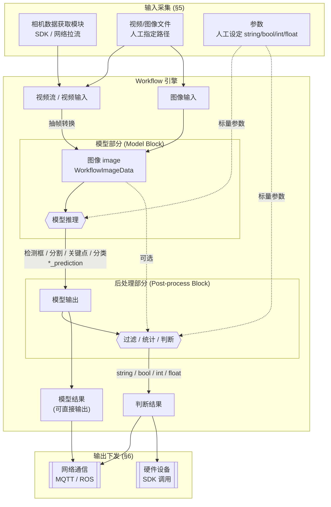
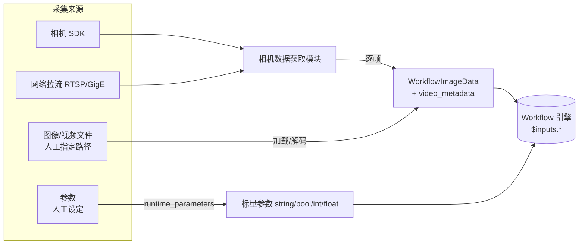

# AutoPipe Workflow 输入 / 输出接口设计

> 关联代码：`backend/workflow/block/entities.py`（Kind 类型系统）、
> `backend/workflow/flow/entities.py`（输入/输出声明、`WorkflowImageData`）、
> `backend/workflow/engine/data_manager.py`（运行时数据流）。
> 本文档在既有 `Kind` 类型系统与 `WorkflowImage/WorkflowParameter/JsonField`
> 声明之上，定义 workflow 端到端的输入、输出、以及内部「模型 + 后处理」两段
> 数据流的接口与数据形态，不引入新的类型词汇。

---

## 1. 设计目标与范围

一个 workflow 描述一条「从原始输入 → 模型推理 → 后处理判断 → 对外输出」的
处理流水线。本设计需要明确回答四件事：

1. workflow **能接收哪些输入**、以什么数据形态进入引擎；
2. workflow **能产出哪些输出**、以什么数据形态离开引擎；
3. workflow 内部 **模型部分 / 后处理部分** 各自的输入输出接口；
4. 输入如何 **采集**（相机 SDK / 网络 / 文件 / 人工参数），输出如何
   **下发**（MQTT / ROS / 硬件 SDK）。

类型词汇统一复用 `block/entities.py` 中的 `Kind`：

| Kind 常量 | `name` | 用途 |
|---|---|---|
| `IMAGE_KIND` | `image` | 图像（`WorkflowImageData` 承载） |
| `VIDEO_METADATA_KIND` | `video_metadata` | 视频帧元信息（帧号 / 时间戳 / fps） |
| `OBJECT_DETECTION_PREDICTION_KIND` | `object_detection_prediction` | 检测框 |
| `INSTANCE_SEGMENTATION_PREDICTION_KIND` | `instance_segmentation_prediction` | 分割结果 |
| `KEYPOINT_DETECTION_PREDICTION_KIND` | `keypoint_detection_prediction` | 关键点 |
| `CLASSIFICATION_PREDICTION_KIND` | `classification_prediction` | 分类结果 |
| `STRING_KIND` / `INTEGER_KIND` / `FLOAT_KIND` / `BOOLEAN_KIND` | `string`/`integer`/`float`/`boolean` | 标量参数与判断结果 |

> 说明：`Kind` 是纯描述性的类型声明，供编译期做引用类型检查与文档展示，
> **引擎运行时不做强制转换**（见 `block/entities.py` 模块 docstring）。

---

## 2. Workflow 输入接口

### 2.1 支持的输入种类

| 输入种类 | 声明类型 | 进入引擎的数据形态 | 对应 Kind |
|---|---|---|---|
| 视频流 | `WorkflowVideoStream`（本文档新增声明，见 §2.3） | 逐帧解码为 `WorkflowImageData`（带 `video_metadata`） | `image` + `video_metadata` |
| 视频文件 | `WorkflowVideo`（新增声明） | 逐帧解码为 `WorkflowImageData`（带 `video_metadata`） | `image` + `video_metadata` |
| 图像 | `WorkflowImage`（**已存在**，`flow/entities.py:50`） | `WorkflowImageData` | `image` |
| 参数 | `WorkflowParameter`（**已存在**，`flow/entities.py:58`） | `str` / `bool` / `int` / `float` 标量 | `string`/`boolean`/`integer`/`float` |

- 参数类型限定为 `string / bool / int / float`（`WorkflowParameter.default_value`
  的 `Union[float, int, str, bool, list, dict]` 已覆盖，业务上约束到前四种标量）。
- 「视频流」与「视频文件」在语义上都是 **帧序列源**，二者的区别只是采集方式
  （实时拉流 vs 读文件）。它们进入引擎后 **统一被抽帧模块转换为图像**，
  以 `image` kind 参与后续计算 —— 这一转换是模型部分的前置约束（见 §4）。

### 2.2 输入声明示例（workflow JSON）

```json
{
  "version": "1.0.0",
  "inputs": [
    {"type": "WorkflowVideoStream", "name": "camera",   "source": "rtsp://..."},
    {"type": "WorkflowImage",       "name": "still"},
    {"type": "WorkflowParameter",   "name": "conf_thres", "default_value": 0.5},
    {"type": "WorkflowParameter",   "name": "enable_ng",   "default_value": true}
  ],
  "steps":   [ ... ],
  "outputs": [ ... ]
}
```

### 2.3 新增输入声明（对齐既有 `InputType` 判别联合）

在 `flow/entities.py` 的 `WorkflowInput` 体系下新增两个 batch-oriented 声明，
并入 `InputType = Annotated[Union[...], Field(discriminator="type")]`：

```python
class WorkflowVideo(WorkflowInput):
    type: Literal["WorkflowVideo"]
    path: Optional[str] = None          # 人工指定的视频文件路径
    @classmethod
    def is_batch_oriented(cls) -> bool: return True

class WorkflowVideoStream(WorkflowInput):
    type: Literal["WorkflowVideoStream"]
    source: Optional[str] = None        # 拉流地址 / 相机标识；由采集模块解析
    @classmethod
    def is_batch_oriented(cls) -> bool: return True
```

二者与 `WorkflowImage` 一样是 batch-oriented（一次运行对应一批帧）。运行时它们
被抽帧后仍以 `WorkflowImageData` 流经引擎，因此下游 block 只需声明
`Selector(kind=[IMAGE_KIND])` 即可同时兼容图像 / 视频 / 视频流三种来源。

---

## 3. Workflow 输出接口

### 3.1 支持的输出种类

workflow 的对外输出通过 `JsonField`（`flow/entities.py:76`）声明，每个输出是一个
命名字段，指向某个 step 输出的 selector（`$steps.<step>.<output>`）。输出内容分两类：

| 输出类别 | 数据形态 | 对应 Kind |
|---|---|---|
| **模型结果** | 检测框 / 分割结果 / 关键点 / 分类结果 | `object_detection_prediction` / `instance_segmentation_prediction` / `keypoint_detection_prediction` / `classification_prediction` |
| **判断结果** | `str` / `bool` / `int` / `float` 标量 | `string` / `boolean` / `integer` / `float` |

- 模型结果通常用于可视化、二次分析或直传下游；
- 判断结果是 **后处理段** 输出的业务结论（如 `OK/NG`、缺陷数量、置信分数），
  是驱动硬件 / 消息下发的主要载荷。

### 3.2 模型结果的数据结构约定

模型结果为「预测项列表」，每类 kind 的元素结构约定如下（与既有
`brightness_classifier` 的分类输出风格一致，`models/brightness_classifier/v1.py`）：

```python
# object_detection_prediction：检测框
[{"class": "defect", "confidence": 0.93,
  "xyxy": [x1, y1, x2, y2]}, ...]

# instance_segmentation_prediction：分割（框 + 掩码/多边形）
[{"class": "defect", "confidence": 0.90,
  "xyxy": [...], "mask": <rle|polygon>}, ...]

# keypoint_detection_prediction：关键点
[{"class": "person", "confidence": 0.88, "xyxy": [...],
  "keypoints": [{"name": "nose", "x": .., "y": .., "confidence": ..}, ...]}, ...]

# classification_prediction：分类
[{"class": "bright", "confidence": 0.97},
 {"class": "dark",   "confidence": 0.03}]
```

> 坐标一律为原图像素坐标系；`confidence ∈ [0,1]`。掩码可用 RLE 或多边形，
> 由具体模型 block 在其 `describe_outputs()` 的 kind 上标注并在 `run()` 中产出。

### 3.3 输出声明示例（workflow JSON）

```json
"outputs": [
  {"type": "JsonField", "name": "detections", "selector": "$steps.detector.predictions"},
  {"type": "JsonField", "name": "verdict",    "selector": "$steps.judge.result"},
  {"type": "JsonField", "name": "ng_count",   "selector": "$steps.judge.count"}
]
```

引擎 `run(runtime_parameters)` 返回 `Dict[str, Any]`，键即上述 `name`：
`{"detections": [...], "verdict": "NG", "ng_count": 3}`。

---

## 4. Workflow 内部结构：模型部分 + 后处理部分

一个 workflow 内部由若干 block（step）组成，按职责分两段。二者都是普通
`WorkflowBlock`，接口约束通过各自 manifest 字段的 `Selector(kind=[...])` 与
`describe_outputs()` 表达。

### 4.1 模型部分（Model Block）

| 接口 | Kind 约束 | 说明 |
|---|---|---|
| **输入** | `image`（必填）+ 若干标量参数（`string/integer/float/boolean`） | 视频流 / 视频输入已被抽帧转成 `image`；参数如 `conf_thres`、`iou`、模型选择等 |
| **输出** | `object_detection_prediction` / `instance_segmentation_prediction` / `keypoint_detection_prediction` / `classification_prediction` 之一或多个 | §3.2 的预测项列表结构 |

manifest 形态（参考 `brightness_classifier` 模型 block）：

```python
class DetectorManifest(WorkflowBlockManifest):
    type: Literal["autopipe/detector@v1"]
    image: Selector(kind=[IMAGE_KIND])                 # 只接受图像
    conf_thres: float = 0.5                            # 标量参数
    @classmethod
    def describe_outputs(cls):
        return [OutputDefinition(name="predictions",
                                 kind=[OBJECT_DETECTION_PREDICTION_KIND])]
```

**关键约束：模型部分只吃 `image`。** 因此 workflow 的视频流 / 视频输入必须先经过
「抽帧」转换（可由采集模块在入口完成，或由一个 transformation block 完成），
才能连到模型 block 的 `image` 端口。

### 4.2 后处理部分（Post-process Block）

| 接口 | Kind 约束 | 说明 |
|---|---|---|
| **输入** | workflow 支持的输入（`image` / `video_metadata` / 标量参数）**＋** 模型输出（四类 prediction） | 用 `Selector()`（wildcard）或指定 kind 声明 |
| **输出** | `string` / `boolean` / `integer` / `float` 标量 | 业务判断结论 |

后处理典型职责：按阈值 / 数量 / 类别过滤与统计模型结果，结合参数得出
`OK/NG`（`boolean`/`string`）、缺陷数（`integer`）、评分（`float`）等。既有
`property_definition`、`expression`、`detections_filter`、`detections_count` 等
block 即属此类（`blocks_library/formatters|math|fusion|analytics`）。

manifest 形态（参考 `property_definition` 后处理 block）：

```python
class JudgeManifest(WorkflowBlockManifest):
    type: Literal["autopipe/judge@v1"]
    predictions: Selector(kind=[OBJECT_DETECTION_PREDICTION_KIND])  # 吃模型输出
    min_conf: float = 0.5                                           # 吃参数
    @classmethod
    def describe_outputs(cls):
        return [OutputDefinition(name="result", kind=[STRING_KIND]),   # OK/NG
                OutputDefinition(name="count",  kind=[INTEGER_KIND])]  # NG 数量
```

### 4.3 端到端数据流流程图



**读图要点：**
- 视频流 / 视频 → **抽帧** → `image`，与图像输入汇合后统一喂给模型；
- 模型部分：输入 `image` + 参数，输出四类 `*_prediction`；
- 后处理部分：输入 = workflow 输入（图像/参数） ＋ 模型输出，输出标量判断结果；
- 对外输出既可以是模型结果（可视化/存档），也可以是后处理判断结果（驱动下发）。

---

## 5. 输入方式（采集）

| 方式 | 说明 | 落地形态 |
|---|---|---|
| **相机数据获取模块** | 通过相机 **SDK** 或 **网络**（RTSP/GigE 等）实时获取帧 | 对应 `WorkflowVideoStream.source`，采集模块解析后逐帧产出 `WorkflowImageData` |
| **参数人工设定** | 运行前由用户在界面/配置中设定 | 对应 `WorkflowParameter`，通过引擎 `run(runtime_parameters)` 注入（`data_manager.get_input_value` 解析 `$inputs.name`） |
| **图像 / 视频文件** | 需人工指定文件路径 | 对应 `WorkflowImage` / `WorkflowVideo.path`，由文件加载（`utils/tools.load_image_from_file`） |



- 采集模块与引擎解耦：采集模块负责「拿到帧 / 参数」，引擎只认
  `WorkflowImageData` 与标量。相机 SDK 的差异（品牌、协议）封装在采集模块内。
- 参数通过 `runtime_parameters` 在 **每次运行时** 覆盖默认值，无需重编译
  （对应 `InputSubstitution`，`flow/entities.py:187`）。

---

## 6. 输出方式（下发）

workflow 引擎 `run()` 产出 `Dict[str, Any]` 后，由 **输出下发适配器** 转发到外部
系统。适配器与引擎解耦：引擎只产出结构化结果，适配器负责协议编码与设备交互。

| 方式 | 通道 | 典型载荷 |
|---|---|---|
| **网络通信** | **MQTT**：发布到指定 topic | JSON：`{"verdict":"NG","ng_count":3,"detections":[...]}` |
| | **ROS**：发布到指定 topic（自定义 msg / std_msgs） | 判断结果标量 + 可选检测框数组 |
| **硬件设备 SDK** | 直接调用设备 SDK（如 PLC / IO 卡 / 剔除机构） | 由判断结果映射为设备动作（如 `NG → 触发剔除`） |

```mermaid
flowchart LR
    engine[(Workflow 引擎<br/>run() -> Dict)] --> res[结果<br/>模型结果 + 判断结果]
    res --> adapter{输出下发适配器}
    adapter -->|发布 topic| mqtt[MQTT Broker]
    adapter -->|发布 topic| ros[ROS 节点]
    adapter -->|SDK 调用| hw[硬件设备<br/>PLC / IO / 剔除]
    mqtt --> sub[订阅方: 上位机 / 看板]
    ros  --> node[ROS 下游节点]
```

- 判断结果（`string/bool/int/float`）是下发的主载荷，语义明确、体积小，适合
  实时控制；模型结果（prediction 列表）作为可选附带载荷用于追溯/展示。
- 一个 workflow 的输出可同时下发到多个通道（如既发 MQTT 看板、又调硬件剔除）。

---

## 7. 接口契约小结

| 环节 | 输入 | 输出 |
|---|---|---|
| **Workflow** | 视频流 / 视频 / 图像 / 参数(string,bool,int,float) | 模型结果(检测框/分割/关键点/分类) + 判断结果(string,bool,int,float) |
| **模型部分** | 图像 + 参数 | 检测框 / 分割 / 关键点 / 分类 |
| **后处理部分** | workflow 输入 + 模型输出 | string / bool / int / float |
| **采集** | 相机 SDK/网络、人工参数、人工指定文件 | `WorkflowImageData` / 标量参数 |
| **下发** | 引擎结果 Dict | MQTT / ROS / 硬件 SDK 动作 |

**类型系统一致性**：所有连接点的类型均以 §1 的 `Kind` 表达，block 通过
`Selector(kind=[...])` 声明入口约束、通过 `describe_outputs()` 声明出口 kind，
编译器据此做引用类型检查；视频流 / 视频经抽帧统一为 `image` 后，模型 block 无需
关心来源差异。

